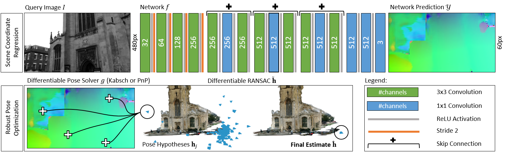

# Homography-based loss project
- [Introduction](#introduction)
- [Installation](#installation)
- [Datasets Setup](#datasets-setup)
- [Training](#training)
- [Testing and Results ](#testing-and-results)

## Introduction
This repository is about replementation of DSAC\* [(found in this github repo)](https://github.com/vislearn/dsacstar). DSAC\* is a learning-based visual re-localization method to get the camera 6-D pose (the camera rotation and translation) from single new image from the specific scene. This can be done by training DSAC\* on the specific scene images.
DSAC\* is a combination of [Scene Coordinate Regression](https://ieeexplore.ieee.org/document/6619221) with CNNs and [Differentiable RANSAC (DSAC)](https://arxiv.org/abs/1611.05705) for end-to-end training. 


The DSAC is implemented in C++ and this code changes the loss function for DSAC and replaces it with homography-based loss function presented in this [paper](https://arxiv.org/abs/2205.01937).The idea behind this change is to enhance the training of this pipline to decrease the estimated pose error. 

## Installation
The repository contains an environment.yml that you can easily install the conda enviroment:
```bash
conda env create -f environment.yml
conda activate homographyloss
```
You compile and install the C++ extension for DSAC\* by executing:
```bash
cd dsacstar
python setup.py install
```
## Datasets Setup 

Kindly refer to this [(this github repo)](https://github.com/clementinboittiaux/homography-loss-function) for datasets structure and how to setup the datasets for training and testing.

## Training

The training consists of two parts: Initializing scene coordinate regression, and end-to-end training.
### Initalization for scene coordinate regression
### End-to-end training

## Testing and Results 


